# AFFBWheel (Arduino Force FeedBack Wheel)

[Описание на русском](readme_rus.md)

This is project of Arduino based wheel controller with force feedback.

- 8 axes: steering(X), accelerator(Y), brake(Z), clutch(Rx), and 4 additional(Ry, Rz, Slider, Dial - e.g. for thumbstick, handbrake, etc).
- 32 buttons.
- FFB effects: constant/ramp/square/sine/triangle/sawtooth/spring/damper/inertia/friction
- Wheel range can be changed on the fly: 1080/900/360/270/180 degree or any other value.

Unfortunately, there isn&apos;t much information about conditional FFB effects, my implementation can be incorrect.  
However, modern games typically use only constant force to emulate other effects.

## Hardware:

- Arduino Atmega32U4 board (Leonardo, ProMicro, Micro, etc)
- incremental encoder or TLE5010/AS5600 sensor for steering axis.
- potentiometers for analog axes
- 4x shift registers 74HC165 (alternately - I2C expanders MCP23017)
- BTS7960 driver
- DC motor
- 12-24v DC power source for motor
- 5v DC power source for Arduino 5v (optional - can be powered from USB)
- optional: ADC MCP3204, ADS1015, or analog multiplexer 74HC4051/74HC4052/74HC4067 + shift register 74HC164

Project uses USB HID communication code from [VNWheel](https://github.com/hoantv/VNWheel) project (great thanks to hoantv&apos;s work).

## Instructions for the firmware

1. Download the project from github as *zip*: <br>
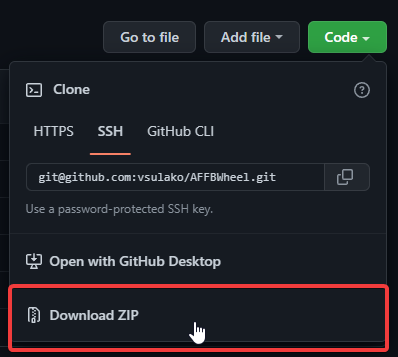 <br>
And unzip the archive to any convenient folder.
2. Download [Arduino IDE](https://www.arduino.cc/en/software).
3. Download additional libraries:
   - [digitalWriteFast](https://github.com/NicksonYap/digitalWriteFast)
   - [avdweb_AnalogReadFast](https://github.com/avandalen/avdweb_AnalogReadFast)
   - [Encoder](https://github.com/PaulStoffregen/Encoder)
4. Install the downloaded libraries:
   - 4.1. Download the library as *zip*.
   - 4.2. Open *Arduino IDE*, then click **Sketch > Include Library > Add .ZIP Library....** and select *zip* with downloaded library. [Instruction in English](https://docs.arduino.cc/software/ide-v1/tutorials/installing-libraries): <br>
   
5. Open the folder where you unpacked the project archive, go to the **[AFFBWheel](AFFBWheel/)** folder and open the **[AFFBWheel.ino](AFFBWheel/AFFBWheel.ino)** file in *Arduino IDE*.
6. Make the necessary changes to the **[config.h](AFFBWheel/config.h)** file for customization.
7. Connect the *Arduino* board to your PC.
8. Select your board type *Arduino* **Tools > Board** (Leonardo, ProMicro, Micro, etc.): <br>
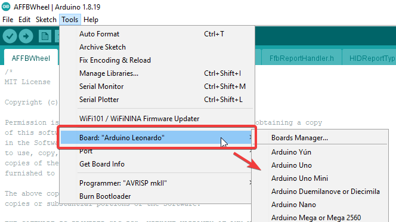
9. Select the port on which *Arduino* is detected **Tools > Port**: <br>

10. Click the upload button: <br>
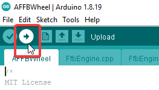
11. Wait for the firmware process to finish. All is ready!

### Wiring diagram:

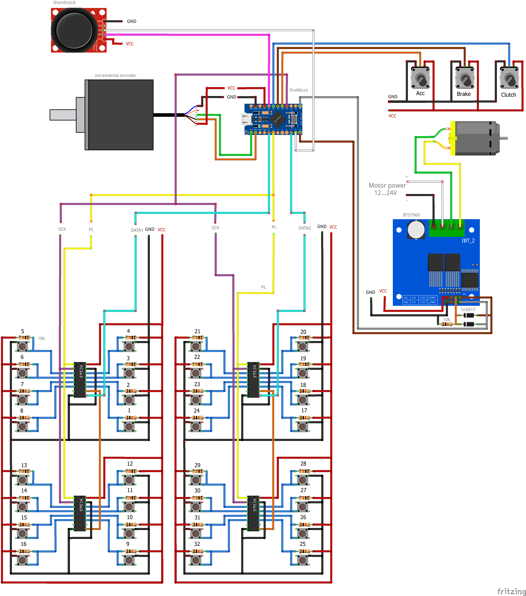

*The connection diagram is shown on the example of **Arduino Pro Micro**, for the rest of the boards, the pinout is exactly the same with the same numbers.
There are slight differences for **[Arduino Leonardo](#leonardo-instead-of-promicro)** in the location of pins on the board.*

*There are also several options **[motor driver connection](#motor-control)**.*

There are two separate lines of shift registers, 16 buttons each.  
Thus, 16 buttons can be placed on wheel, and 16 more on wheelbase or gearbox.

#### Decoupling

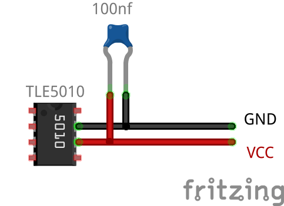

For lowering noise it is recommended to add decoupling capacitors (ceramic 100nf...1uf between VCC and GND) to all bare IC&apos;s (TLE5010, 74HC165, 74HC4052, MCP2304...) close as possible to IC. Modules already have these.


#### Encoder PPR

Set encoder PPR in config.h, in line `#define ENCODER_PPR 400`.

#### Blocking unneeded analog axes.

If analog axis pin is not connected to potentiometer, axis will produce noise. To avoid that, either pull axis pin to GND with 1-10kOhm resistor, or disable axis output with command `axisdisable`. So, axis will always report same value and will not mess up when detecting axes in games.  
Also, 4 additional axes (AUX1-AUX4) can be disabled in config.h. Just comment out line `#define PIN_AUXN ..`.  
Disabled axis will be excluded from polling (saving ~45us of computing time) and will always report 0%.

#### If a game does not support DIY wheels

You can try to use controller emulator [GIMX](https://gimx.fr/). You will need an Atmega32U4 board (Leonardo/promicro/teensy2/etc) and CP1202 USB-UART adapter.

#### [Alternate hardware configurations](#althw).

### Testing software:
- [VKB joystick tester](https://vkbcontrollers.com/?page_id=4609)
- [VKB button tester](https://vkbcontrollers.com/?page_id=4609)
- [FEdit](https://gimx.fr/wiki/index.php?title=Force_Feedback)

## Configuration.

Configuration options are in config.h, mostly for different hardware configurations (see [below](#althw)).

## Settings and commands.

Changeable settings can be changed on the fly using [GUI](https://github.com/vsulako/AFFBWHeelGUI) or commands on serial port.  
For most commands, if no value is given, command prints current setting.

- `center`  
Set current wheel position as center.

- `centerbtn`  
`centerbtn <button>`  
Print/set centering button. 
`<button>` - number of button, 1-32. 0 value means no centering button.  
One button can be selected for performing "center" command. This button will be excluded from input.
	
- `range`  
`range <degrees>`  
Print/set wheel range in degrees (e.g. 900).
	
- `axisinfo <axis>`  
Enable data output (axis current position and other values are printed to serial port) for one of axes.  
Axes are:  
 **0** - **wheel**  
 **1** - **accelerator**  
 **2** - **brake**  
 **3** - **clutch**  
 **4** - **aux1**  
 **5** - **aux2**  
 **6** - **aux3**  
 **7** - **aux4**  
 **no value** - **disable output**  
This output slows down, do not forget to disable it when you do not need it.  

- `limit <axis>`  
`limit <axis> <min> <max>`  
Print/set minimum and maximum raw values for analog axis.  
Wheel limits are changed with `range` command.

- `axiscenter <axis>`  
`axiscenter <axis> <pos>`  
Print/set raw center position for analog axis.  
Use it when axis has distinct center position (e.g. thumbstick. Pedals do not need center) and does not align well.  
If center position is set beyond limits (less than min or greater than max), it becomes disabled.  
Disabled center means that center will be set automatically in middle between min and max (autocenter=1).

- `axisdz <axis>`  
`axisdz <axis> <dz>`  
Print/set center deadzone for analog axis.  
If axis has center set with `axiscenter` command, a deadzone for center position can be applied.  
Units are raw. (e.g., if axis has center=500, and dz=10, axis will return 0 when raw position is between 490 and 510).  
If you need deadzones at edges, just set axis limits less than actual limits.  
Deadzone does not apply if axis have no center set (autocenter=1).

- `axisdisable <axis>`  
Enable/disable axis output.  
Axis with disabled output will report permanent minimum value (0%).

- `axistrim <axis>`  
`axistrim <axis> <trimlevel>`  
Print/set bit trimming value for analog axis.  
This reduces resolution of raw axis reading for lowering noise. E.g. if `<trimlevel>` is 3, axis value will change with steps of 8 (2 in power of 3).
If axis has noise, you can try to raise this value (however, it's better to find cause of noise, instead of hiding it with this)

- `autolimit <axis>`  
Enables/disables autosetting min/max values for analog axis [1..5].  
Each time when axis exceeds current min/max, it's position becomes new limit.  
(i.e.: enable autolimit, push pedal from limit to limit, disable autolimit - limits are set)  
This setting disables center position and deadzone.

- `debounce <count>`  
Print/set debounce value for buttons.  
If it is greater than zero, change in buttons state will be registered only if buttons do not change state for `<count>` cycles (1 cycle is about 1ms)  
If you encounter button bouncing, try increasing this value.

- `gain <effectNum>`  
`gain <effectNum> <value>`  
Print/set gain for effect.  
Possible values of `<effectNum>` are:  
**0** - **total** (applies to all effects except endstop),  
**1** - **constant**  
**2** - **ramp**  
**3** - **square**  
**4** - **sine**  
**5** - **triangle**  
**6** - **sawtoothdown**  
**7** - **sawtoothup**  
**8** - **spring**  
**9** - **damper**  
**10** - **inertia**  
**11** - **friction**  
**12** - **endstop** (force that does not allow to turn wheel beyond range)  
Default value is 1024 which equals 100%. 2048 = 200%, 512 = 50% and so on.

- `forcelimit <minforce> <maxforce> <cutforce>`  
Print/set minimum/maximum PWM value for FFB (in internal units, [0..16383]) and force cutting value.  
If force is not zero, it's absolute value will be scaled from [1..16383] range to [minforce...maxforce].  
There is a tiny slope at low values, to avoid kicking when going from negative minforce to positive and vice versa.  
If resulting absolute force is greater than `<cutforce>` value, it will be constrained to `<cutforce>`.  
Default values are `minforce=0`, `maxforce=16383` and `cutforce=16383` (which results in no changes).  

- `maxvd`  
`maxvd <value>`  
Print/set maximum velocity value for damper effect.  
Effect calculating requires setting of maximum velocity which will correspond to maximum force.  
Increasing this parameter decreases damper strength, and vice versa.  

- `maxvf`  
`maxvf <value>`  
Print/set maximum velocity value for friction effect.  
It affects effect only at tiny values of velocity.

- `maxacc`  
`maxacc <value>`  
Print/set maximum acceleration value for inertia effect.  
Increasing this parameter decreases inertia strength, and vice versa.

- `endstop`  
`endstop <offset> <width>`  
Print/set endstop effect parameters.  
  
`<offset>` (0..16383) - level endstop effect will start from. Increasing this parameter makes endstop effect harder.  
`<width>` - length of excess position where endstop effect will rise to maximum level. Decreasing this parameter makes endstop harder.

- `ffbbd`  
`ffbbd <value>`  
Print/set PWM bitdepth for FFB. (sign ignored: bitdepth 8 means 256 steps from 0 to maximum force, thus giving range [-255..0..255])  
Bitdepth affects PWM frequency: freq = 16000000 / 2^(bitdepth+1)  
Precalculated values :  
**8** : 31.25 kHz  
**9** : 15.625 kHz  
**10** : 7.8 kHz  
**11** : 3.9 kHz  
**12** : 1.95 kHz  
**13** : 0.97 khz  
**14**  : 0.48 kHz  
Default bitdepth is 9, frequency 15.625kHz. It seems to be optimal and is not supposed to be changed.  
Greater values result in lower frequency, which cause annoying noise.  
Lower values just lose resolution and do not perform better.

- `save`  
Save current settings to EEPROM.  
Settings changed by commands are lost on reset without save.  
This command saves current settings.

- `load`  
Load saved settings from EEPROM. Happens at start.  
On error (i.e. there is no saved  data, or data is corrupted) default settings are applied.  

- `defaults`  
Load default settings.

- `timing`  
Turn on/off debug output of time in microseconds consumed for different procedures, and "loops per second" count.  
S - time of reading steering axis position  
A - time of reading analog axes  
B - time of reading buttons  
U - time of USB communication  
F - time of FFB calculation  
loop/sec - loops per second  

- `fvaout`  
turn on/off debug output of FFB value, steering axis velocity and acceleration into axes Rz, Slider, Dial (aux2/aux3/aux4).  
This is significally faster than output to serial port and allows to see graphs in apps like VKB Joystick Tester.

<a name="althw"></a>
## Alternate hardware configurations.

### Misc:

- Diodes 1n5817 shown on diagrams can be replaced with any other diodes: 1n4148, 1n5819 and so on.

### Leonardo instead of ProMicro:

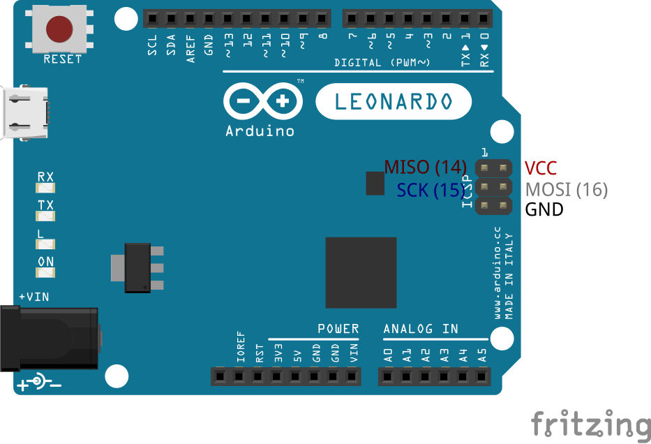

On Leonardo board pins 14,15,16(MISO, SCK, MOSI - for SPI) are placed on ICSP connector.  
All connections are same as for ProMicro.

### Motor control.

There are 3 variants of BTS7960 connection:

1) this is shown on main diagram. EN pins of BTS7960 are connected with diodes.

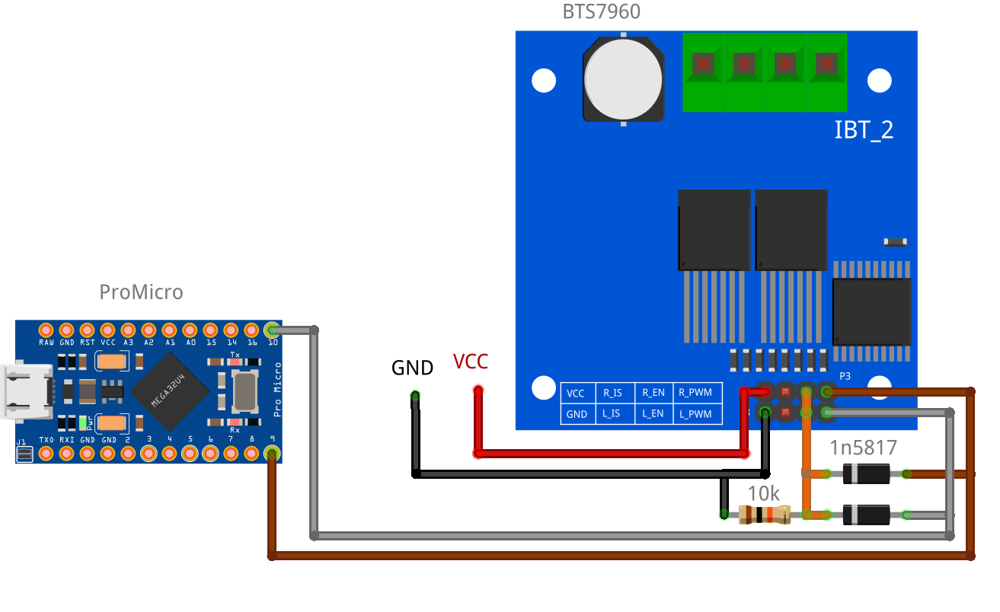

Motor is online only in duty part of PWM period, which gives "softer" force feedback.

2) EN pins are controlled by separate wire.

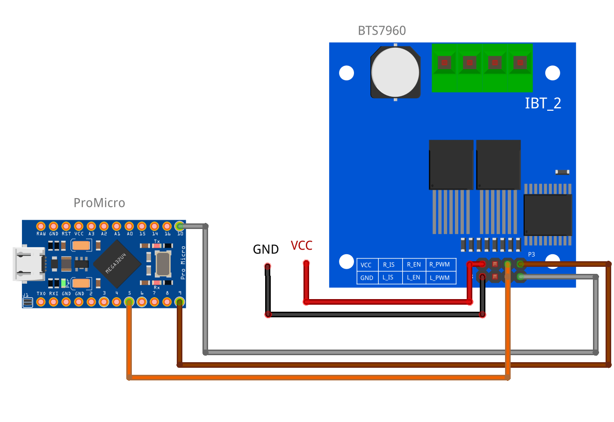

Here motor is online when FFB is active. FFB feels harder and more powerful than in variant #1, but wheel becomes "heavier".  
This variant requires to uncomment `#define MOTOR_ENABLE_PIN ` and set a pin to use.

3) EN pins are permanently connected to VCC.

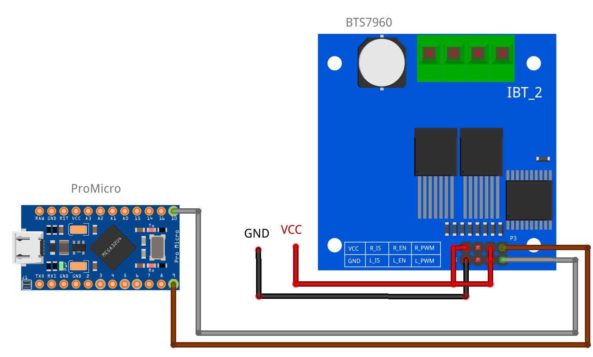

FFB feels like variant #2, but motor is always online, which leads to constant "load" of wheel. On other hand, free pin is not needed.

Hardware (motors, reductors, etc...) and preferences are different for different people, so try all variants and choose what suits you better.

### Alternate options for steering axis:

#### TLE5010:

TLE5010 is a digital sensor that allows to get angle of magnetic field rotation. It can be used instead of encoder.

Wiring diagram:

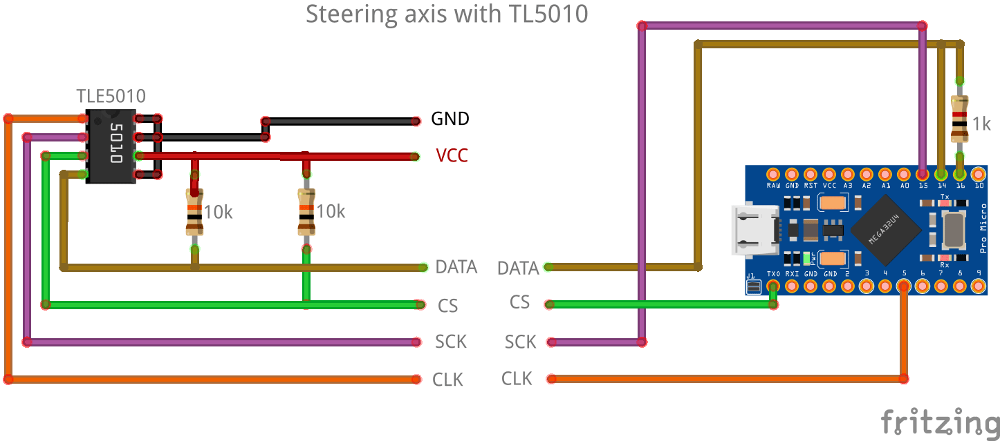

[full schematics](images/base_TLE5010.png)

Placement of magnet and TLE5010:

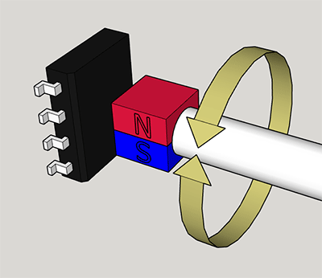

Magnet is placed at top center of steering axis, TLE5010 is placed against it, airgap is 1-3 mm.
Magnet pole separating line must be faced to TLE5010.

Changes in config.h:

- uncomment `#define STEER_TYPE ST_TLE5010`
- comment `#define STEER_TYPE ST_ENCODER`

Include libraries:

- [TLE5010](https://github.com/vsulako/TLE5010)

#### AS5600

AS5600 - 12-bit digital magnet rotation sensor with I2C interface. It is used similar to TLE5010.

Wiring diagram:
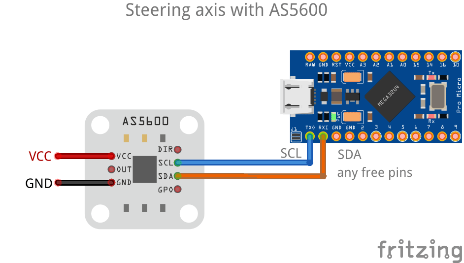

Remove resistor R1 (0ohm) if powering module with 5v.

Changes in config.h:
- uncomment `#define STEER_TYPE ST_AS5600`
- comment other lines with `STEER_TYPE`
- set I2C pins (any free pins can be used):
	```cpp
	#define I2C_PIN_SDA 0
	#define I2C_PIN_SCL 1
	```
In case of using another I2C devices (AD1015,MCP23017) - connect in parallel to same pins.

### Alternate options for analog axes (pedals):

#### Option #1: pullups.

This allows to use 4 wires unstead of 5.
Simple and cheap, but has some disadvantages.
- readings become nonlinear, additional processing is required to linearize them. (however, linearization can be turned off)
- does not allow to replace potentiometers with hall sensors (no VCC wire)
- all analog axes must have pullups.

Wiring diagram:  
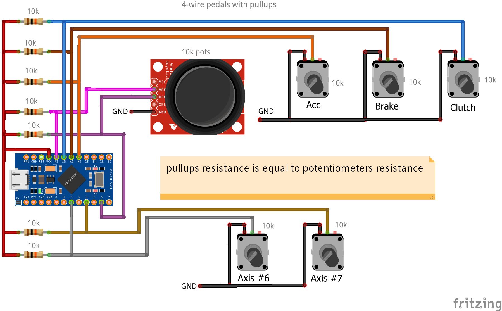

Pullup resistance must be equal to axis potentiometer resistance.

Changes in config.h:  
- uncomment line `#define AA_INT_PULLUP`
- uncomment line `#define AA_LINEARIZE` if you need linearizing.

#### Option #2: analog multiplexer 74HC4051/74HC4052/74HC4067 + shift register 74HC164

Also allows to use 4 wires unstead of 5.

Wiring diagrams:  
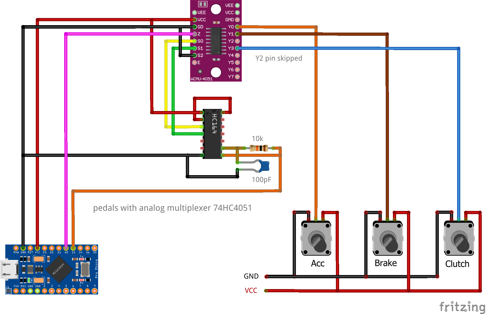  
[Wiring diagram for 74HC4052](images/pedals_HC4052.png)  
[Wiring diagram for 74HC4067](images/pedals_HC4067.png)

Changes in config.h:

- uncomment line `#define PEDALS_TYPE PT_MP_HC164` (and comment other lines with `PEDALS_TYPE`)

#### Option #3: external ADC MCP3204 
MCP3204 is fast enough 12-bit 4-channel ADC with SPI interface(6 wires). 
However, communication can be fit into 5 and even 4 wires.

Wiring diagrams:  
[6 wires](images/pedals_MCP2304_6w.png)  
[5 wires](images/pedals_MCP2304_5w.png)  
[4 wires v1](images/pedals_MCP2304_4w_v1.png)  
[4 wires v2](images/pedals_MCP2304_4w_v2.png)  
[4 wires v3](images/pedals_MCP2304_4w_v3.png)

In case of using TLE5010 wires are connected in parallel:  
[6 wires + TLE5010](images/pedals_MCP2304_TLE5010_6w.png)  
[5 wires + TLE5010](images/pedals_MCP2304_TLE5010_5w.png)  
[4 wires v1 + TLE5010](images/pedals_MCP2304_TLE5010_4w_v1.png)  
[4 wires v2 + TLE5010](images/pedals_MCP2304_TLE5010_4w_v2.png)

Changes in config.h:
- for 5 or 6 wires: 
	- uncomment `#define PEDALS_TYPE PT_MCP3204_SPI` (and comment other lines with `PEDALS_TYPE`)
- for 4 wires:
	- uncomment `#define PEDALS_TYPE PT_MCP3204_4W` (and comment other lines with `PEDALS_TYPE`)
	- set pins for SCK, MISO and MOSI according to selected variant (v1, v2, v3 on diagrams):
		- For v1 (reuse MOSI/MISO):
		```cpp
		#define MCP3204_4W_PIN_SCK		A0
		#define MCP3204_4W_PIN_MOSI		16
		#define MCP3204_4W_PIN_MISO		14
		```
		- For v2: (reuse SCK)
		```cpp
		#define MCP3204_4W_PIN_SCK		15
		#define MCP3204_4W_PIN_MOSI		A0
		#define MCP3204_4W_PIN_MISO		A0
		```
		- For v3: (separate wires)
		```cpp
		#define MCP3204_4W_PIN_SCK		A0
		#define MCP3204_4W_PIN_MOSI		A1
		#define MCP3204_4W_PIN_MISO		A1
		```

#### Option #4: external I2C ADC ADS1015	

Wiring diagram:
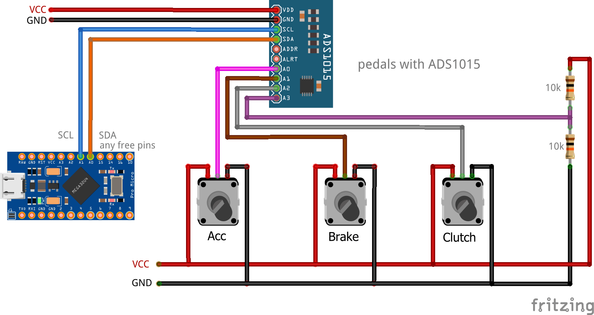

This ADC is relatively slow (~0.3ms per conversion), therefore axes will be read one per loop, resulting in 3x lower reading rate.  
Also, it has fixed voltage references (±2.048V is used), so with 5v VCC potentiometers will have ~10% deadzones at min and max. 
If you need to use full potentiometer range, it can be compensated by adding couple of resistors([wiring diagram](images/pedals_ADS1015_resistors.png)) to each potentiometer (start with resistance = 1/10 of potentiometer resistance)  
Another option is to provide 4.1v voltage for potentiometers (e.g. with TL431 - [wiring diagram](images/pedals_ADS1015_TL431.png)).

Changes in config.h:

- uncomment `#define PEDALS_TYPE PT_ADS1015` (and comment other lines with `PEDALS_TYPE`)
- set I2C pins (any free pins can be used):
	```cpp
	#define I2C_PIN_SDA A0
	#define I2C_PIN_SCL A1
	```
In case of using another I2C devices (AS5600,MCP23017) - connect in parallel to same pins.

### Alternate options for buttons.

#### Option #1: 74HC165 4-wire
It is possible to get rid of PL wire (from 74HC165 to Arduino), and use only 4 wires.

Wiring diagram:  
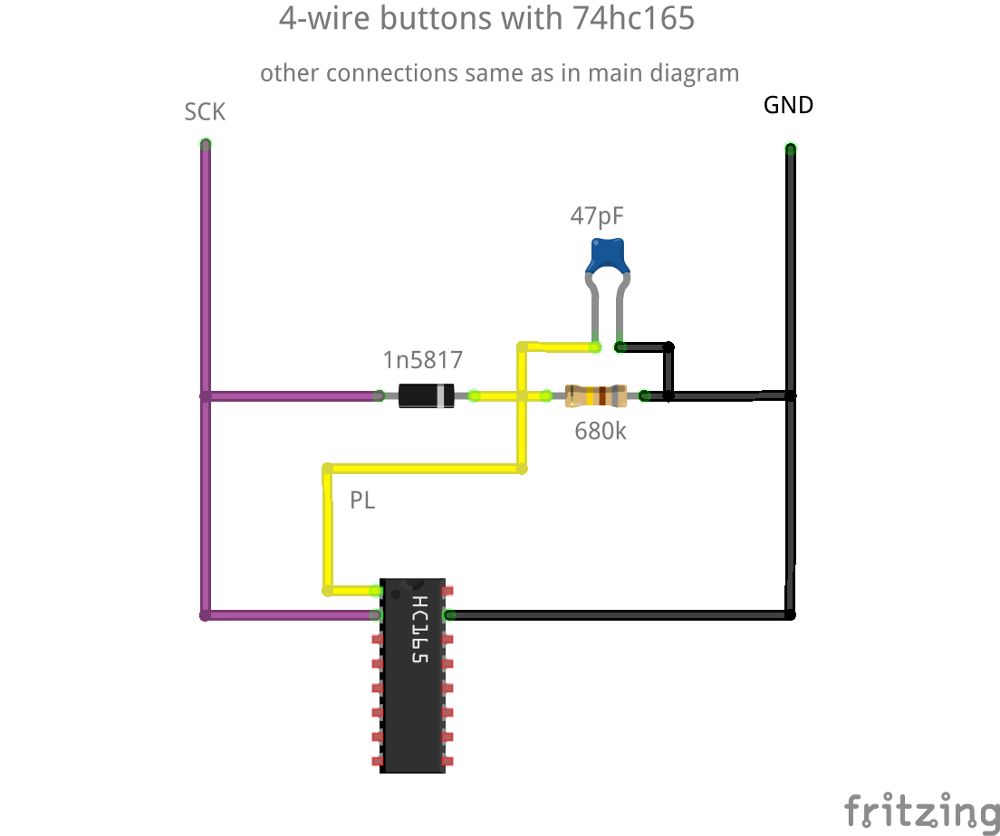

Changes in config.h:
- make sure that line `#define BUTTONS_TYPE BT_74HC165` is uncommented and other line with `BUTTONS_TYPE` is commented.
- comment line `#define HC165_PIN_PL`

#### Option #2: I2C extenders MCP23017

Wiring diagram:  
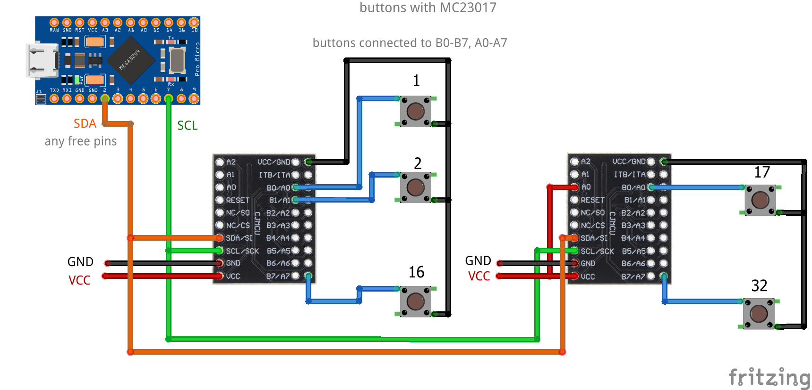

Changes in config.h:
- uncomment line `#define BUTTONS_TYPE BT_MCP23017` (and comment other line with  `BUTTONS_TYPE`)
- set I2C pins (any free pins can be used):
	```cpp
	#define I2C_PIN_SDA 2
	#define I2C_PIN_SCL 7
	```
In case of using another I2C devices (AS5600,AD1015) - connect in parallel to same pins.

#### Option #3: Shift registers CD4021B

CD4014B seems to be compatible (not tested in hardware, because I don't have any).

Connections are similar to 74HC165, but chip pinout is different:

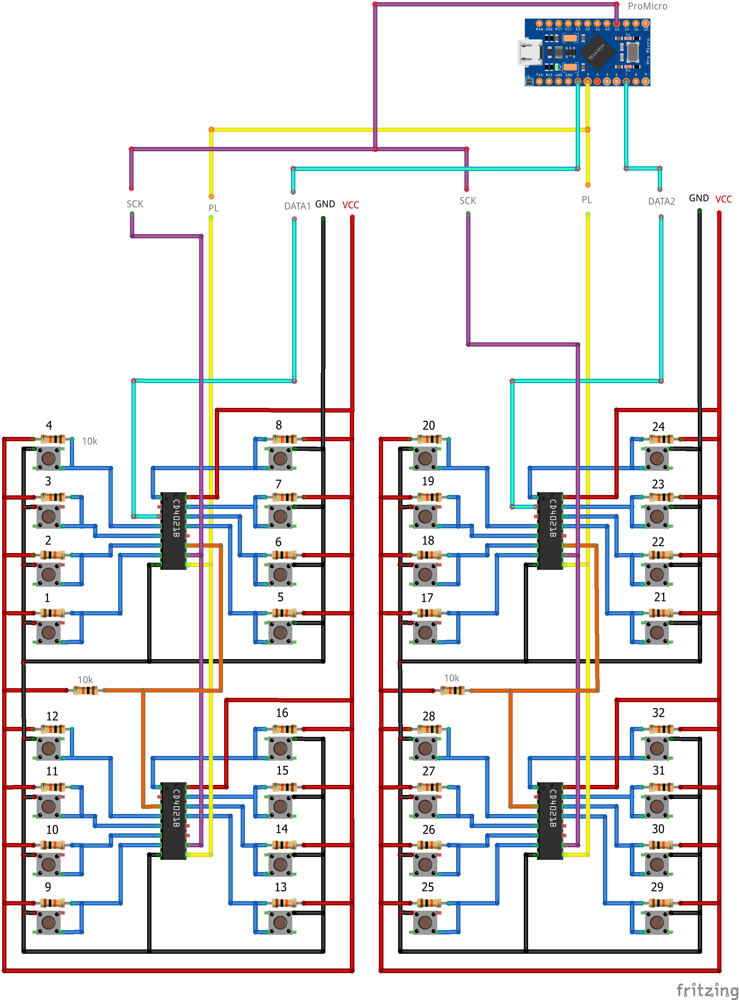

Getting rid of PL line for 4-wire connections is also possible:

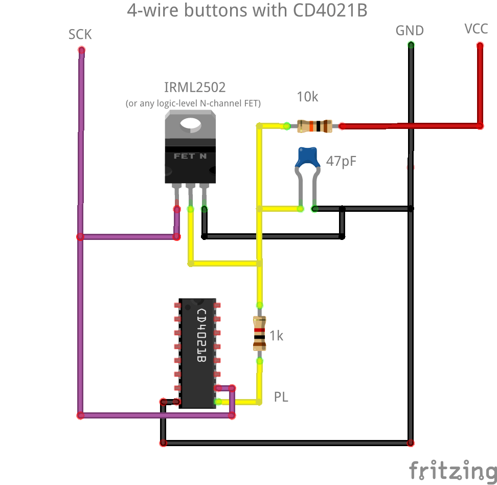

Changes in  config.h:
- uncomment  `#define BUTTONS_TYPE BT_CD4021B` and comment other lines with `BUTTONS_TYPE`
- if you're using RC trick shown above for omitting PL line, comment line `#define CD4021_PIN_PL`

## Additional features

### Buttons on analog pin

There is possibility to use multiple buttons, connected to single analog arduino pin.

Wiring diagrams:

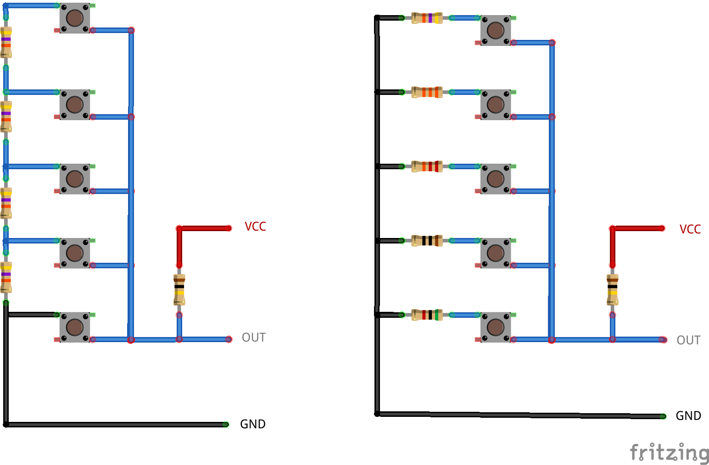

Principle: when button is pressed, analog pin voltage is changed.

Advantage: only 3 or 2 wires can be used to connect multiple buttons.  
Disadvantage: only one button can be pressed simultaneously, so only use case is for gear shifter.

Configuration example:

```
#define APB                     //uncomment to enable feature
#define APB_PIN        A11      //analog pin
#define APB_BTN_COUNT  2        //number of buttons connected
#define APB_VALUES     32,96    //ADC values (0-255) for each button
#define APB_TOLERANCE  10       //tolerance (plus-minus to ADC value)
#define APB_BTNS       25,26    //numbers of redefined buttons (1-32)
```

This means:
- 2 buttons are connected to pin A11, they will replace buttons #25 and #26
- button #25 will be considered pressed, if ADC value of A11 will be around 32±10, i.e. from 22 to 42.
- button #26 will be considered pressed, if ADC value of A11 will be around 96±10, i.e. from 86 to 106.

Command `apbout` in Serial monitor will print ADC values from selected pin.

### Analog H-shifter.

A H-shifter made like stick, with 2 potentiometers instead of buttons can be used.  
Potentiometers are connected to unused analog pins.  
H-shifter can have 6 or 8 positions.

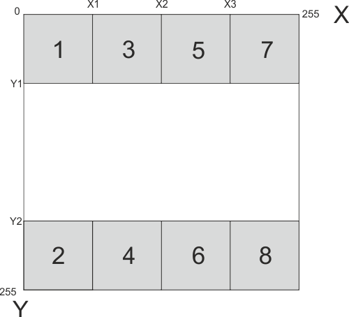

X axis represents ADC from one potentiometer, Y axis from another.  
Button N is considered pressed, if current X/Y values are in corresponding zone (gray).  
X1,X2,X3,Y1,Y2 values set zone bounds. Values must be in ascending order, i.e. X1<X2<X3, Y1<Y2.  
X3 is not used for 6-position config.

ADC values can be printed out by command `ahsout` in Serial monitor.

Configuration in config.h:

```
#define ASHIFTER                //uncomment to enable feature
#define ASHIFTER_PINX     A4    //analog pin for potentiometer X
#define ASHIFTER_PINY     A5    //analog pin for potentiometer Y
#define ASHIFTER_POS      8     //number of positions, 6 or 8
#define ASHIFTER_Y1       50    //zone bounds (0-255)
#define ASHIFTER_Y2       200
#define ASHIFTER_X1       64  
#define ASHIFTER_X2       128  
#define ASHIFTER_X3       192
#define ASHIFTER_1ST_BTN  25    //number of button for pos 1 (1-32)
```

Buttons will be redefined in series, starting from ASHIFTER_1ST_BTN.  
If 8-position is used, first button is 25, shifter will use buttons #25,26,27,28,29,30,31,32.

### Hat switch

Any 4 buttons can be defined for using as 8-position hat switch.

Configuration in config.h:

```
#define HATSWITCH           //uncomment to enable feature
#define HAT_BTN_UP     20   //button numbers for hat directions
#define HAT_BTN_DOWN   21
#define HAT_BTN_LEFT   22
#define HAT_BTN_RIGHT  23
#define HAT_CLR_BTNS   	    //if this line is commented, selected buttons will continue to register presses along with hat switch
```